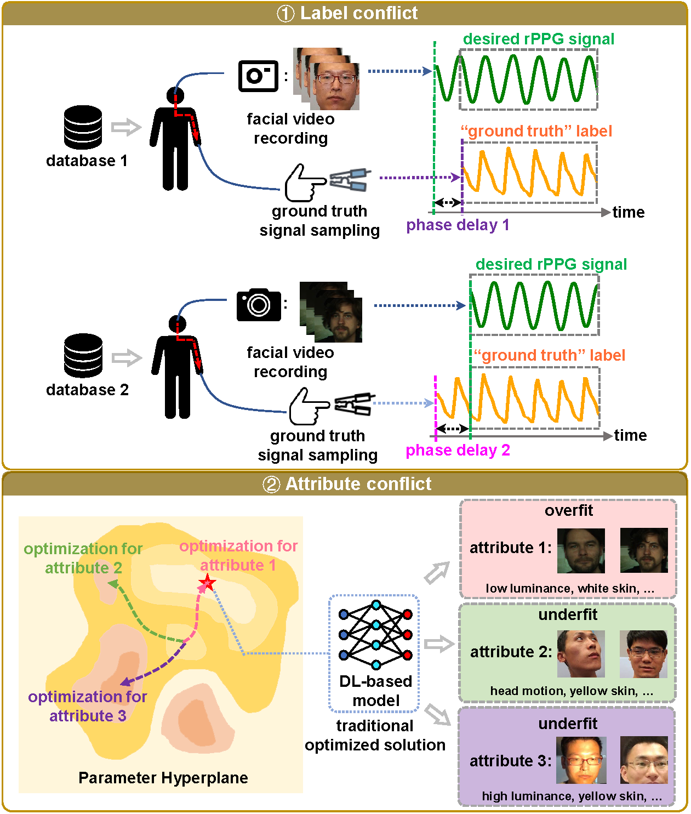

# DOHA-rPPG (DOmain-HArmonious framework)
This is the code corresponding to the paper "Resolve Domain Conflicts for Generalizable Remote Physiological Measurement." accepted in ACM MM 2023:fire: :fire: :fire:.

## What is rPPG? :crossed_fingers: :crossed_fingers: :crossed_fingers:
Generally speaking, remote photoplethysmography (rPPG) is a special  kind of physiological measurement which measures the physiological information (such as heart rate) of the subject through his/her facial video. The overall workflow of a typical rPPG is shown as follows:

The key element of rPPG is to extract the so-called **rPPG signal** from the facial video. The rPPG signal is regarded to presented the similar physiological features with **Blood Volume Pulse (BVP) signal**, from which we can extract various physiological information, such as heart rate.

## Current domain conflict Issues of DNN rPPG model training:
Related databases for rPPG model training have the following flaws. (1) **Label Conflict**: The ground truth rPPG signals (e.g., BVP signal) in the database are not uniformed in time, i.e., there exist a unknown temporal delay between label and truth rPPG signal. (2) **Attribute Conflict**: The individual variability of data (e.g., skin color, ambient light) renders the rPPG model inefficient to train. We illustrate above two issues as follows:

